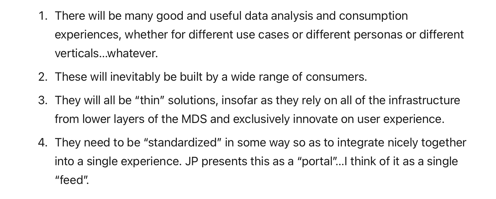

# Data

## Data industry overview

- Note: there’s a lot of overlap in some of these initial pieces
- [Emerging Architectures for Modern Data Infrastructure](https://future.com/emerging-architectures-modern-data-infrastructure/)
   - Start here, and maybe end here too. I found the original version of this hard to grok on the first read.
- [What I’ve learned about data recently](https://seldo.com/posts/what-i-ve-learned-about-data-recently)
- [2021 MAD Landscape](https://mattturck.com/data2021/): a brute with lots of unnecessary detail, but some pretty useful commentary/context
- [The one data platform to rule them all](https://leighmariebraswell.substack.com/p/the-one-data-platform-to-rule-them) - reasonably accessible overview
- [The State and Future of Data Tooling](https://podknife.com/episodes/the-state-and-future-of-data-tooling-with-leigh-marie-braswell-and-erik-bernhardsson) (podcast)
- [The Modern Data Stack: Past, Present, and Future](https://www.getdbt.com/blog/future-of-the-modern-data-stack/)
   - One of the most important posts here, if not the most important. Written by CEO of dbt, a key part of the “MDS” (36,000 people on the [dbt slack](https://www.getdbt.com/community/), which I recommend joining and lurking on the various BI channels)
- [Top BI tools of 2021](https://blog.panoply.io/top-25-business-intelligence-tools-and-how-to-decide)

## Further data-related thinking/context

- [Data is for dashboards](https://benn.substack.com/p/data-is-for-dashboards) – written by the founder of Mode Analytics
   - To me, there is a dichotomy between (A) certified/maintained and (B) ad hoc data/dashboards; this post implicitly focuses on (A). However, probably the majority of actual “dashboards” created are for (B). So ad hoc, stale “dashboards” accumulate and compete with “Purpose A” dashboards, creating data discovery/maintainability/trust issues.
   - In addition: making a great / nice dashboard is hard and time consuming because it is actually a data design PLU UX/UI design problem. Very few people can do this well; most dashboards are sucky.
   - Related: [The Entropy of Knowledge](https://clrcrl.com/2021/11/30/fighting-the-entropy-of-knowledge)
- [Self-service analytics](https://amplitude.com/blog/self-service-analytics)
- DBT’s new [semantic layer](https://www.getdbt.com/blog/dbt-semantic-layer/) - (same as “metrics layer” (?))
   - Informed opinion about the emerging “[metrics layer](https://prakasha.substack.com/p/the-metrics-layer-has-growing-up)”
- [Knowledge sharing](https://kaminsky.rocks/2020/09/knowledge-sharing/)
- [Twitter thread](https://twitter.com/emilykund/status/1528931550431219713?s=21&t=crn17B2_OF0B4ckGVdouBw) about a kind of persona that prefers to code their dataviz and not use Tableau
- [Excel never dies](https://www.notboring.co/p/excel-never-dies?s=r)
- [Purple people](https://www.getdbt.com/blog/we-the-purple-people/) - has kind of taken hold as an idea
- Tweet about [tool fragmentation](https://twitter.com/thekensta/status/1422690100547293186?s=20&t=RJ6G4ylX_qlOIWgzTZFEzw)
- Newsletters
   - [dbt roundup](https://roundup.getdbt.com)
      - Possibly the most useful extract so far is from [Sep 2021](https://roundup.getdbt.com/p/from-rows-to-people)

## OODA

- [Intro to OODA](https://fs.blog/ooda-loop/)
   - our stated purpose is to make data accessible to anyone
      - that is in service of helping people to make better decisions, faster—i.e. driving the OODA loop—primarily by improving orientation and secondarily by enabling more implicit decisions
- [The Essence of Winning and Losing](https://fasttransients.files.wordpress.com/2010/03/essence_of_winning_losing.pdf) - the canonical OODA reference slide(s)

## Figma, collaboration and more

- [The Arc of Collaboration](https://kwokchain.com/2019/08/16/the-arc-of-collaboration/) – “Why Slack is an Else Statement, there is no distinction between productivity and collaboration…”
- [Why Figma Wins](https://kwokchain.com/2020/06/19/why-figma-wins/) - fantastic insights, that helped to shape my/our vision for this product
   - We’re not the only ones to notice… some [comments from the data world](https://pedram.substack.com/p/data-can-learn-from-design)
- About Figma’s initial [platform launch](https://www.figma.com/blog/introducing-figmas-platform/): useful reference for thinking about our own platform/extensibility + [announcement article](https://www.fastcompany.com/90165051/as-design-and-engineering-blur-figma-wants-to-be-their-platform)

## Marketing and growth

- [Your startup is a movement](https://sacks.substack.com/p/your-startup-is-a-movement)
- [Product-led growth’s failure](https://every.to/napkin-math/product-led-growth-s-failure) – is a bad title but interesting case study of positioning success
- [Growth loops](https://www.reforge.com/blog/growth-loops)
   - [Notes on Superhuman’s Acquisition Loops](https://kwokchain.com/2019/10/24/notes-on-superhumans-acquisition-loops/)
- [Narrative distillation](https://kwokchain.com/2021/09/29/narrative-distillation-1/) – need to spend more time on this

## Startups

- [Second system effect](https://medium.com/holes/second-system-effect-1a4a1cf76836) (recommended to me by Keerti)
- [Investing in vices and virtues](https://greylock.com/greymatter/vices-and-virtues-investing-and-human-nature/)
- [How not to die](http://www.paulgraham.com/die.html) – “So I’ll tell you now: bad shit is coming”
- [Desperation-induced focus](https://rkg.blog/desperation-induced-focus.php), or process is a bug not a feature

## Other

- Phenomenal [thread on product leadership](https://twitter.com/scottbelsky/status/1441469884953600004?s=21) by Scott Belsky
- [The “Bitter Lesson” of AI research](http://www.incompleteideas.net/IncIdeas/BitterLesson.html): is that general methods that leverage computation are ultimately the most effective, and by a large margin.
- [Great analysis of Microsoft](https://luttig.substack.com/p/dont-forget-microsoft) who if we’re successful will be our biggest competitor (PowerBI & Excel)
- Point of view on [Async work](https://levels.io/async/)
- [We don’t sell saddles here](https://medium.com/@stewart/we-dont-sell-saddles-here-4c59524d650d) – still a classic, and seems especially relevant to us

