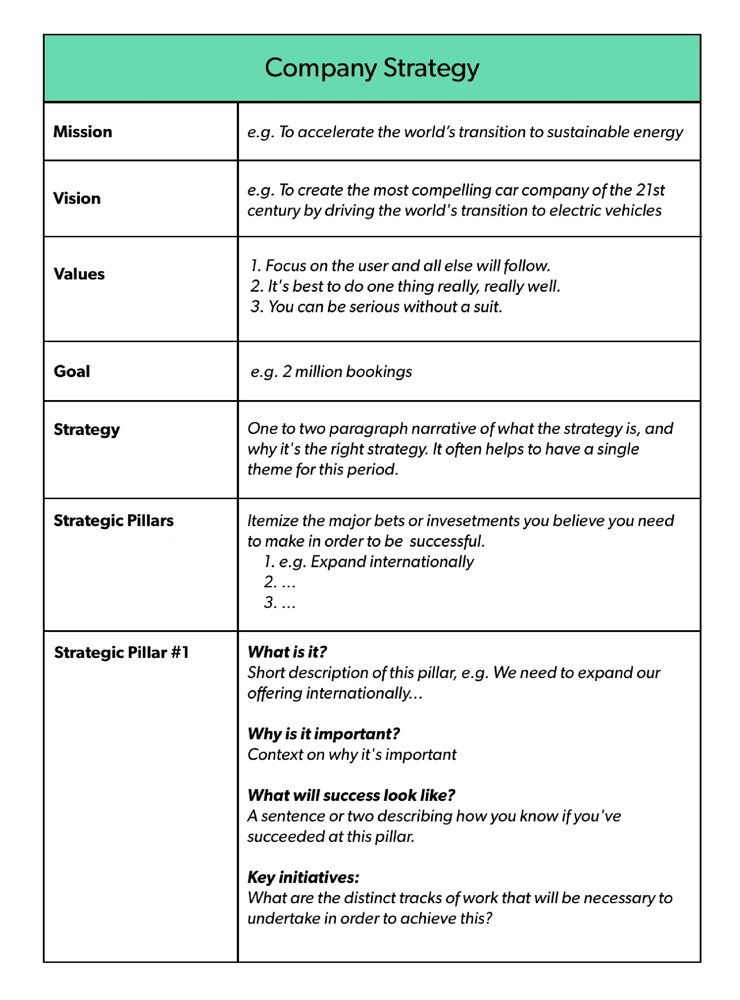

# Campaigns

**What are Campaigns?**

Form of influence-management and rallying the troops, as we grow in numbers and complexity.

**What does it include?**

Similar to the case in politics, a campaign includes:

1. A vision for a better future: include metric and timeline
2. A clear audience to influence: include metric, if applicable
3. A status quo or opponent to beat: include change target

**How does it work?**

Everything that we do in the company, not just in marketing, can be defined in campaigns.

- If you cannot define it as a campaign, it is probably not that important.
- You can rally your team with a campaign and justify growing your team for a campaign.
- You might not be able to understand or sell the meaning behind an objective / key result until it is wrapped as a campaign.
- Each campaign by design will come with a hero who wins or loses, and many who will be inspired to be part of the journey.
- Within company wide initiatives to HR efforts to sales ops, all that are important can be defined as a collection of campaigns.
- Campaign results are easy to measure since goals around wants/needs, audience and status quo are defined in smaller chunks.
- Overall, a company’s success can be defined with a collection of results from individual campaigns from each department and function.

**What’s an example?**

Absorption initiative can be wrapped as a campaign. List below is simple enough for our board to understand. Everything else underneath these items are simply tasks executed across the company.

1. A vision for a better future: “10 production installs by Apr’22”
2. A clear audience to influence: “Double SE promoter score”
3. A status quo or opponent to beat: “No engineering touch for evals”

**How does it relate to Commit & Beat?**

Within the Commit & Beat mantra, I think about a Campaign as the definition of what’s being measured. Something meaningful, inspirational, impactful enough to rally the troops.

**How do we look at this company wide?**

High-level company wide view is below. The journey for the campaigns have to start with statements for company-wide vision, mission and values statements.

Then you can dive into goals and strategies for different categories / functional teams to get the stuff done: in the example below, marketing is divided into three buckets. More than three, again, things get a bit out of hand. These are the key goals and strategies highlighted in the image below, which is usually the template the industry follows.

When compared to the generic template highlighted in the image below, strategic pillars and the relevant content essentially turns into campaigns.

The structure then is: (example below for marketing)

- Company-wide mission, vision and value statements
- Each functional area needs to figure out their goals in three strategic pillars
- Each strategic pillar is treated as a campaign

A company-wide example can be structured as 1x3x3 and target a period of two years. An essential element are the timelines noted; they try to answer “in what time period, can we start measuring results for a campaign?”

- Vision Statement > Company Level Campaigns
   - Three categories for campaigns each with a timeline: GTM (1-6 mos), Product (6-12 mos), People (12-24 mos)
   - Each Campaign translates to many Activities across Pods, driving a key result, follows the format in the example above.
   - Campaigns concept can be used with sub-categories below where necessary to report on commits and key results.
- GTM – Three sub-categories with timelines: Marketing (1 mo), Sales (3 mos), Biz Dev (6 mos).
- Product – Three sub-categories with timelines: R&D (6 mos), PLM (9 mos), CTO (12 mos).
- People – Three sub-categories with timelines: Hiring (12 mos), Development (18 mos), Promotion (24 mos).

**Template**

Why do we care about X today / next few quarters?

- ...

What do we want from this initiative - metrics / goals / timeline?

1. ...–opportunity goal - with leading and lagging indicators, and unless …
2. …–enablement goal - “”
3. …–product goal - “”

How do we get there - with a set of activities?

- …
- …
- …

Activity types

- Make us go on the offense | or play defense with people to influence
- Are repeated frequently to create momentum | or done one time
- Help product get better | or help customers better understand

**E.G. Marketing**

1/ Build our brand, condition the market for 5G LAN.

"Influence habits, form positive awareness" measured by "customers, partners, analysts promoting us"

- Vision for a better future: 12 non-edu references by end of 2022
- Audience to influence: Gartner/ IDC cool vendor or leader reports
- Status quo to beat: Market association "private 5G in the enterprise = 5G LAN"

2/ Discover the most productive watering holes for lead conversion.

"Digital / physical acts to drive qualified meetings" measured by "growing contribution to qualified pipeline"

- Vision for a better future: Predictable S2 growth per month by Aug'22
- Audience to influence: Double conversion for sales from SAL to SQL by Nov'22
- Status quo to beat: Lack of clear understanding in top-3 lead source mix

3/ Accelerate sales stages with field enablement and community growth.

"turn customers / partners into advocates" measured by "# of engineers trained, certified and engaged"

- Vision for a better future: 50 engineers certified for 5G LANs by Feb'23
- Audience to influence: 50 active in partner portal per month by Feb'23
- Status quo to beat: Lack of clarity in data-based competitive intelligence

Incorporate “formula for being a great company”

- You can create value with breakthrough innovation, incremental refinement, or complex coordination. Great companies often do two of these. The very best companies do all three.

